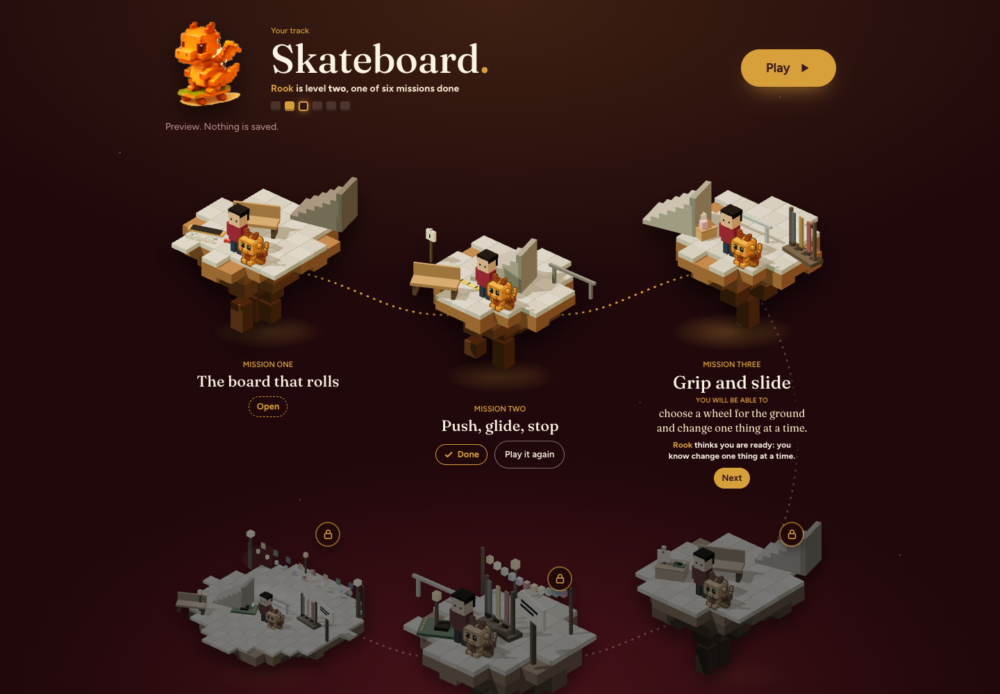

## Akshat Koirala

AI engineer and founder of [Nell & Key](https://www.nellandkey.com), a learning product for children in grades 1 to 7. Mathematics and Economics, Macalester College (B.A. 2026).
I build LLM features that are measured before they ship: evals first, tests that have been seen to fail, and a person in the loop.

The Skateboard road on a preview page, captured by a scripted browser walk.

### What I am building

- **Roads of missions.** A child follows one road per interest (Trumpet, Spanish, Websites, Skateboard). Each mission sits on its own voxel island and opens when the engine's knowledge model says the child is ready for it.
- **Simulations that report.** Each mission holds a small simulation in a sandboxed frame. It tells the page what the child's hands did, such as a prediction made before a test, not only right or wrong.
- **A person in the loop.** A model may draft a mission, but nothing reaches a child until a tutor or I publish it.

### The engineering

- **Evals before trust.** The mission writer redrafts 15 hand built gold missions from their blueprints, and the lesson spec's rules grade every draft (15 of its 17 can be checked from the text). The graders ran on the gold first: 8 of the 15 failed, each one the grader's fault. A copy check then exposed a leak in my own method.
- **Tests that can fail.** A suite counts only after it has been seen to fail: 346 deliberate mutants in 25 lists break the code on purpose and must turn the tests red. Browser walks press real keys: the Skateboard road walk plays all six missions at three screen widths, 262 checks.
- **Human votes as the signal.** In Mission Arena a tutor describes a class, two sealed generators each write a lesson, the tutor plays both and votes, and only then sees who wrote which. The votes rank the generators. The signal comes from adults: children's data trains nothing, and parents own it.
- **Agents, orchestrated.** AI coding agents write most of the code. One central session plans, reviews and merges; each worker gets one brief and one branch; one gate (types, tests, bundles, lint, a dash and secret check) runs in CI on every push to main and every pull request ready for review. I own the architecture, the evals and every release.
- **Cost as a feature.** Mission drafts, model turns and voice renders pass a spend ledger with ceilings per draft, per family and per month. The tests run against a scripted model on the loopback, never a paid one.

The product code is private. The [case study](https://github.com/KoKa-Akshat/nell-and-key-case-study) has the architecture and the eval, with every number traced to a file in the private repository.

### Selected projects

| Project | What it is |
| --- | --- |
| [nell-and-key-case-study](https://github.com/KoKa-Akshat/nell-and-key-case-study) | How Nell & Key is built and measured, without product code |
| [academic-quant-portfolio](https://github.com/KoKa-Akshat/academic-quant-portfolio) | Macalester coursework: backtests in Python, computational linear algebra in R, econometrics in Stata, a math modeling capstone |
| [fluFrenzy](https://github.com/KoKa-Akshat/fluFrenzy) | A two person course project: a Python Tkinter game about flu on campus, with a toy R0 estimate |

### What I am learning now

An eight week plan, one card a day, from 30 September to 24 November 2026:

- **AI engineering.** An LLM service with a replaceable provider; an eval harness with deterministic graders, a rubric and a baseline before any change; retrieval experiments (keyword baseline, embeddings, an oracle context test); LLM security (threat models, authorization, model output treated as untrusted); reliability (stale writes, outbound limits, budgets, rollback); an untouched holdout, then a stranger runs it cold.
- **Robotics, on the side.** From one embedded control loop to a small simulated swarm, judged by repeatable trials rather than demos.

### Reach me

- [nellandkey.com](https://www.nellandkey.com)

Open to AI engineer roles.

**Tools:** TypeScript, Node, Python, Firebase, Vercel, the OpenAI, Groq and Anthropic APIs, ElevenLabs and Azure Speech, the Chrome DevTools Protocol, R, Stata.
